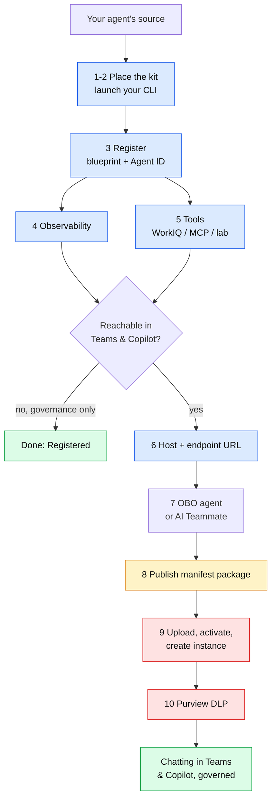

# Onboarding a custom agent to Microsoft Agent 365 — end to end

This is the complete walkthrough: from your existing agent's source code to an agent that is registered in Agent 365, has an Entra identity, emits observability, can use tools, and — if you want it — answers in Microsoft Teams and Microsoft 365 Copilot with Purview and Defender watching.

You drive it from an AI coding CLI (Claude Code, GitHub Copilot CLI, Cursor, Codex, Gemini CLI, and others). The kit places a set of skills into your project; the CLI reads them and does the work. You type plain-English phrases; a few commands you run yourself, and those are called out explicitly.

Every step is labelled by **who** performs it:

- **[CLI]** the AI CLI does it when you ask
- **[you]** one command in your own terminal
- **[admin]** a tenant admin, in a portal



<sub>Blue = the AI CLI does it · amber = you, in your own terminal · red = an admin, in a portal · green = a finish line.</sub>

> Screenshots for the portal steps go in [`docs/images/`](docs/images/) — see its README for the shot-list. The text steps stand on their own without them.

---

## Before you start

**On your machine:** Node.js 18+, .NET SDK 8+, the `a365` CLI, Azure CLI, Git, an AI coding CLI (below), and Python 3.10+ or Node.js for your agent. The kit's launcher checks all of this and prints the install command for anything missing.

```bash
# .NET SDK 8+ first (the a365 CLI is a .NET tool), then the a365 CLI
winget install --id Microsoft.DotNet.SDK.8 -e        # macOS: brew install --cask dotnet-sdk
dotnet tool install -g Microsoft.Agents.A365.DevTools.Cli
winget install --id Microsoft.AzureCLI -e            # macOS: brew install azure-cli
```

**An AI coding CLI — install at least one.** This is the tool you drive the onboarding from. Pick whichever you use:

```bash
npm install -g @github/copilot            # GitHub Copilot CLI
npm install -g @anthropic-ai/claude-code  # Claude Code
```

Cursor, Codex and Gemini CLI also work — install them from their own docs; the kit's skills are already in the `.agents/skills/` folder they read.

**Windows:** use a normal terminal, never an elevated one — the per-user tools (the AI CLI, `a365`, `az`) are invisible to an Administrator shell.

**Your tenant, once [admin]:** the `a365` CLI needs a one-time app registration. Any admin runs this and every developer inherits it:

```bash
a365 setup requirements
```

Requires Application Administrator (lightest), Cloud Application Administrator, or Global Administrator.

**Sign in [you]:**

```bash
az login --allow-no-subscriptions
```

---

## Step 1 — Put the kit in your agent project

Download the latest release zip into your Downloads folder, then from the **root of your agent project** — the folder containing your agent's source — extract it in place. This is the entire install:

```powershell
# Windows PowerShell, from the project root
cd C:\path\to\your-agent-project
Expand-Archive -Path "$env:USERPROFILE\Downloads\agent365-onboarding-kit-v0.1.0.zip" -DestinationPath . -Force
```

```bash
# macOS / Linux, from the project root
cd ~/path/to/your-agent-project
unzip -o ~/Downloads/agent365-onboarding-kit-v0.1.0.zip -d .
chmod +x agent365-kit.sh
```

The zip has no wrapper directory, so extracting in place gives you:

```
your-agent-project/
  .a365-kit/          skills, add-ons, validators, prerequisite doctor
  .claude/skills/     discovery copy — Claude Code
  .agents/skills/     discovery copy — Copilot, Cursor, Codex, Gemini, Amp, Cline, …
  agent365-kit.ps1    launcher (Windows)
  agent365-kit.sh     launcher (macOS / Linux)
  src/  ...           your agent, already here
```

Starting from nothing? Extract into an empty folder — the skills can scaffold a starter agent.

Committing these folders to your repo is the recommended end state: the skills then travel with the project and teammates need no download.

## Step 2 — Check prerequisites and pick your CLI

```bash
.\agent365-kit.ps1          # Windows
./agent365-kit.sh           # macOS / Linux
```

This changes nothing. It verifies prerequisites, prints the install command for anything missing, detects your CLIs, and prints how to start each. Fix anything it flags, open a new terminal, run it again.

Confirm your CLI sees the skills:

- **Claude Code:** run `claude`, then ask *What Agent 365 skills do you have?*
- **GitHub Copilot CLI:** `copilot skill list`
- **Others:** open the project; the skills are in `.agents/skills/`.

You should see twelve: seven Microsoft skills plus five kit add-ons.

<!--  -->

## Step 3 — Register the agent in Agent 365  [CLI] + [you]

This is the step that puts the agent in the Agent 365 registry and gives it an Entra identity (its **Agent ID**).

**Launch your CLI from the project folder** and give it the trigger phrase. Pick your CLI:

```bash
# GitHub Copilot CLI — interactive, so you approve each action
copilot -i "Onboard this agent to Agent 365."

# Claude Code
claude "Onboard this agent to Agent 365."

# Cursor / Codex / Gemini CLI — open the project and type the phrase in chat:
#   Onboard this agent to Agent 365.
```

Prefer the interactive form over a one-shot `-p` run: registration writes to your tenant, and you want to approve each step. To rehearse first without touching anything, dry-run it:

```bash
copilot -p "Onboard this agent to Agent 365. DRY RUN - do not run commands or modify files. Report which skill you selected, what you detected, and the steps you would perform." --allow-all-tools --deny-tool shell
```

The trigger phrase is the same in every CLI:

> **Onboard this agent to Agent 365.**

The `a365-setup` skill detects your stack and asks three things:

| It asks | Choose |
|---|---|
| Confirm what it detected | `yes`, or correct it |
| Capabilities: Register · Observability · WorkIQ · AI Teammate | `1, 2` for a first run; add WorkIQ for M365 data; AI Teammate only if the agent needs its own mailbox and UPN |
| Auth mode (not asked for AI Teammate) | **OBO** — no admin consent needed |

It writes config and code, then reaches `a365 setup all`. **This command must run in your own terminal** — it signs in through the Windows broker, which cannot show a prompt inside a CLI's shell:

1. Copy the exact command from the CLI's approval prompt.
2. Decline it in the CLI.
3. Paste it into a second normal terminal in the same folder; complete the sign-in.
4. Tell the CLI: *`a365 setup all` completed in a separate terminal. Read `a365.generated.config.json` and continue.*

This creates the **blueprint** (an Entra app registration) and, on the blueprint path, the **Agent ID** (a service-principal agent identity) in one run. For an AI Teammate the identity is a user with a UPN and mailbox, minted later at instance creation.

Then install what the skill added [you]:

```bash
pip install -r requirements.txt        # or npm install / dotnet restore
python -c "import src.agent"           # confirm it still imports
```

Python + WorkIQ: if the import fails on `microsoft_agents_a365.runtime`, add `microsoft-agents-a365-runtime>=1.0.0` and install again.

**You are now Registered.** The agent is in the Agent 365 registry with an identity. If governance is all you need, stop here.

<!--  -->

## Step 4 — Add observability  [CLI]

Make the agent emit telemetry — every message, model call and tool call — to the Agent 365 portal and Microsoft Defender. In your CLI, say:

> **Add observability to this agent.**

If you selected Observability as a capability in Step 3 it is already wired and this confirms it; if you did not, this adds it now. Either way the `instrument-observability` skill does the work. It uses OpenTelemetry: the SDK auto-instruments every model and tool call into spans, an `InvokeAgentScope` wraps each turn, identity baggage is stamped on the context, and an Agent 365 exporter ships the spans out.

**Then check the exporter is actually on.** The `a365` CLI writes `ENABLE_A365_OBSERVABILITY_EXPORTER=false` into `.env`, and the skill deliberately preserves an existing value rather than overwriting it — so the agent ends up instrumented but exporting nothing, and the Activity view stays empty. Confirm and fix in `.env`:

```
ENABLE_A365_OBSERVABILITY_EXPORTER=true
A365_OBSERVABILITY_LOG_LEVEL=info
```

Restart the agent afterwards — the value is read at startup.

Two more values in `.env` worth checking once the agent is running in Teams: `AGENT365OBSERVABILITY__AGENTID` should be the **instance** appId that Teams runs the agent as, not the identity created at setup, or activity attributes to the wrong agent. `A365_OBSERVABILITY_LOG_LEVEL` is sometimes written as the literal option list `info|warn|error`; set it to one value.

Then verify:

> **Validate A365 code.**

The `a365-code-validator` skill checks exporter activation, identity binding, token shape and the required spans, and offers fixes. Re-run it after any fix until it reports clean.

## Step 5 — Tools  [CLI]

An agent gets tools three ways. Add any combination:

| Say | Adds | Governed by Agent 365? |
|---|---|---|
| *Add WorkIQ tools to this agent* | Microsoft 365 data — mail, calendar, Teams, SharePoint, OneDrive, Word, Excel | Yes — Entra-gated |
| *Add an MCP server* | any community MCP server — filesystem, git, GitHub, Postgres, web fetch, Slack, Playwright | No |
| *Add lab tools* | local utilities — web fetch, encoders, hashing, text transforms | No |

The last two are outside the Entra model, so pair them with DLP (Step 9). WorkIQ tokens are per-audience; the skill wires that. If you add several servers, tool names are namespaced automatically so they don't collide.

## Step 6 — Make it reachable in Teams and Copilot  [CLI] + [you]

Only if you want users to chat with it. In your CLI:

> **Make this agent chattable in Teams.**

The `add-messaging-endpoint` add-on:

- adds an HTTP host serving `/api/messages` (for a blueprint agent built from a CLI or library — the AI Teammate path scaffolds its own host),
- proves it locally (health check returns 200; an anonymous message returns 401),
- exposes it through a dev tunnel or a URL you host,
- registers the endpoint on the blueprint [CLI]:

```bash
a365 setup blueprint --update-endpoint https://<host>/api/messages --m365
```

`--m365` is required — without it the Teams routing is silently skipped. Take the public URL from the line `devtunnel host` prints, not from the tunnel name.

Then, one command in your own terminal [you] — it needs the broker:

```bash
a365 setup permissions bot
```

Verify in the Teams Developer Portal (the CLI gives you the link) that **Agent Type = API Based** and the **Notification URL** matches your endpoint.

<!--  -->

## Step 7 — Choose the path: OBO agent or AI Teammate

This decides what happens in Steps 8–9. It was set by your capability choice in Step 3.

| | Blueprint / OBO agent | AI Teammate |
|---|---|---|
| Identity | service principal, created at setup | agentic user with UPN + mailbox, minted at instance creation |
| Acts as | the signed-in user (delegated) | itself |
| Use when | the agent runs elsewhere, or should chat as the caller | the agent should be a member of the org, receive email, be @mentioned |
| Publish command | `a365 publish --aiteammate true` | `a365 publish` |

Both paths require the package upload (Step 8) to appear in Teams and Copilot. The difference is only the publish flag and when the identity is created.

## Step 8 — Publish the manifest package  [you]

The manifest is the Teams app definition — the JSON that makes the agent an installable app and (via `copilotAgents.customEngineAgents`) a Microsoft 365 Copilot custom engine agent. **The CLI owns it; do not hand-edit.** Run in your own terminal (it block-buffers under a CLI):

```bash
a365 publish                    # AI Teammate
a365 publish --aiteammate true  # blueprint / OBO agent (flag selects the package format; does not change the agent's kind)
```

This writes `manifest/manifest.json` and `manifest/manifest.zip`. Edit `name.short` (30 chars max), the description and icons in `manifest/manifest.json` if you want, then run it again.

<!--  -->

## Step 9 — Upload, activate, create the instance  [admin]

Portal only — there is no CLI upload API.

1. **Microsoft 365 admin center → Agents → All agents → Upload custom agent** — upload `manifest/manifest.zip`.
2. **Activate** — scope the audience (start with yourself), grant the requested permissions.
3. **Create instance** — for an AI Teammate this mints the agentic user.

User-driven alternative if you lack the Teams Admin role: sideload the same zip via **Teams → Apps → Manage your apps → Upload a custom app**, then **Request Instance**; an admin approves at `admin.cloud.microsoft/#/agents/all/requested`.

Provisioning is asynchronous — a few minutes, occasionally longer. If **Request Instance** is disabled, Agent 365 Frontier is not enabled on the tenant.

<!--  -->
<!--  -->
<!--  -->

## Step 10 — Govern with Purview DLP  [CLI] + [admin]

> **Add DLP to this agent.**

The `add-purview-dlp` add-on grants the agent identity two Graph scopes, and wires each prompt and response through Purview: `protectionScopes/compute` then `processContent`, blocking on policy. Then the portal steps [admin]:

1. Purview → Settings → **Audit** on.
2. Purview → **Collection policy** capturing AI app interactions (UploadText + DownloadText) for the agent's app location.
3. Purview → **Insider Risk Management** → policy from the *Risky Agents (preview)* template, indicator *Exposing agent to risky prompt*.
4. IRM → **Defender XDR alert sharing** on.

Allow up to 24 hours for the first evaluation.

<!--  -->

## Test

- **Before upload / any path:** *Test this agent locally* opens AgentsPlayground against your host.
- **After upload and activation:** search Teams for the agent by name and chat with it. It also appears in the Microsoft 365 Copilot agent picker.

<!--  -->

---

## The commands you run yourself

Everything else is done by the CLI or a portal. These four need your own terminal:

| When | Command | Why |
|---|---|---|
| Step 3 | `a365 setup all …` | Windows broker sign-in |
| Step 6 | `a365 setup permissions bot` | broker + a consent prompt (blueprint path) |
| Step 8 | `a365 publish [--aiteammate true]` | buffers under a CLI shell |
| Steps 6, 9, 10 | Dev Portal, admin center, Purview | portal-only, no API |

## Troubleshooting

| Symptom | Cause and fix |
|---|---|
| `claude` / `a365` / `copilot` "not found" but installed | Elevated shell. Use a normal one. |
| `a365 setup all` times out / `MSAL … Status 17` | It authenticates via the broker; run it in your own terminal, not through the CLI. |
| `a365 publish` says "Nothing to publish for blueprint-based agents" | Use `a365 publish --aiteammate true` on the blueprint path. |
| Agent registered but not in Teams | The package must be uploaded and activated (Steps 8–9) on both paths. |
| WorkIQ tools all return 401; agent says it has none | Set `PYTHON_ENVIRONMENT=Production` in `.env`, then restart the host. |
| `UserError: Duplicate tool names across MCP servers` | Several WorkIQ servers collide; the add-on sets `include_server_in_tool_names` — re-run it. |
| Import fails on `microsoft_agents_a365.runtime` | Add `microsoft-agents-a365-runtime>=1.0.0` and install. |
| Endpoint stops working after a tunnel restart | A recreated tunnel can change cluster; re-run the Step 6 `--update-endpoint` with the new URL. |
| Teams turn fails with `MCPError` on a later message | External MCP tokens expire; keep servers open for the host's lifetime, not per turn. |

## Going deeper

- [`docs/STEP-BY-STEP.md`](docs/STEP-BY-STEP.md) — the phrases for each stage, condensed.
- [`docs/LIFECYCLE.md`](docs/LIFECYCLE.md) — the reasoning behind each step.
- [`docs/USING-WITH-YOUR-CLI.md`](docs/USING-WITH-YOUR-CLI.md) — per-CLI setup and differences.
- [`docs/HOW-IT-WORKS.md`](docs/HOW-IT-WORKS.md) — how the kit is built and refreshed.
- [`NOTICE.md`](NOTICE.md) — what is Microsoft's and what the kit adds.
